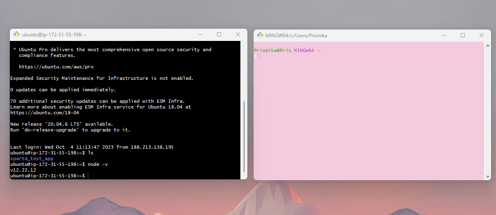

## App and MongoDB deployment. 

1) First, you need to create a new EC2 instance on AWS. This instance is for the app virtual machine. Therefore I have named this ‘tech254_prismika_app’

2) Then you need to  choose the existing AMI that you have created as well as an existing security group. 

3) After the instance has been created, you need to click on your instance ID and press connect. 

4) Then open git bash terminal, access your .ssh folder and connect to your app virtual machine by running your public DNS. 

*note: when you create an instance with an existing AMI, it defaults the user to be root so you need to make sure you change it to ubuntu so you can successfully login without errors*. 

   ```bash
   ssh -i "tech254.pem" ubuntu@ec2-54-78-149-138.eu-west-1.compute.amazonaws.com
   ```

5) After you have logged in, you can run `ls` to make sure your app is there as well as `node -v` to check the version.

   ```bash
   ubuntu@ip-172-31-55-198:~$ ls
   sparta_test_app
   ubuntu@ip-172-31-55-198:~$ node -v
   v12.22.12
   ```

6) Now, you need to open another git bash terminal and this terminal will be used to access the mongo database. I have changed the background colour for my terminal on where I will be working on the database so I do not get confused. 

   Example:

   

7) Now, you need to create another EC2 instance and this will be for our MongoDB. 

8) However for the AMI we wont be using the ones we created, we need browse more AMI’s and search for **`18.04 lts 1e9`.** 

9) For the security group, we are going to change security rules so therefore we will go edit and add a new security group name, I have changed mine too ‘tech254_prismika_db_sg’.

   For the security rule, the only rule we need to add is for the MongoDB database, so you need to select custom TCP and the port range for MongoDB is **27017,** finally for source type you can press anywhere. Then you can launch this instance. 

10) Now you need to go back to your GitBash terminal for your mongodb and connect to your instance, 

11) Run `cd.ssh` followed by your mongodb public DNS 

    Example: 

    ```bash
    Prismika@Pris MINGW64 ~
    $ cd .ssh

    Prismika@Pris MINGW64 ~/.ssh
    $ ssh -i "tech254.pem" ubuntu@ec2-63-32-170-40.eu-west-1.compute.amazonaws.com
    ```

12) Now, we need to set up our MongoDB server, therefore, we need to start the installation by running: 

    ```bash
    sudo apt update 
    sudo apt upgrade -y
    ```

    `sudo apt update` - goes and find away the new packages 

    `sudo apt upgrade -y`- compare what you're currently using and put the new version into effect.

13) Running this command downloads the MongoDB public GPG key and add it to our list of trusted keys on our system by using `sudoapt-key-add` 

    After running this command you should get `OK` 

    Example: 

    ```bash
    wget -qO - https://www.mongodb.org/static/pgp/server-3.2.asc | sudo apt-key add -
    OK
    ```

14) By running the command below it installs and update MongoDB using the package manager. This verifies the key and location. 

    Example:

     ```bash
    echo "deb http://repo.mongodb.org/apt/ubuntu xenial/mongodb-org/3.2 multiverse" | sudo tee /etc/apt/sources.list.d/mongodb-org-3.2.list
    ```

    Followed by the command below in order to update our terminal again:

    ```
    sudo apt update
    ```

15) This command is used to install specific versions of MongoDB components. So you can see from here that its installing the (3.2.20) onto our system. 

    ```bash
    sudo apt-get install -y mongodb-org=3.2.20 mongodb-org-server=3.2.20 mongodb-org-shell=3.2.20 mongodb-org-mongos=3.2.20 mongodb-org-tools=3.2.20
    ```

16) Now we need to open the mongod.conf file :

    ```basic
    sudo nano /etc/mongod.conf
    ```

    and we need to change the bindIP as below.

    Example: 

    ```bash
    net:
      port: 27017
      bindIp:  0.0.0.0
    ```

17) By running this command you start the MongoDB service using the **`systemctl`** command. 

    ```bash
    sudo systemctl start mongod
    ```

18) Running this command allows the service to start automatically upon system boot.

    ```bash
    sudo systemctl enable mongod
    ```

19) You can check the status and make sure MongoDB is running:

    ```bash
    sudo systemctl status mongod
    ```

### GitBash terminal for App instance

20) Now we move over to the app virtual machine terminal, we need to run the following command, by running this code we are exporting the **`DB_HOST`** environment variable with a MongoDB public IP address. 

    ```bash
    export DB_HOST=mongodb://3.249.100.71:27017/posts 
    ```

21) In order to check if it works we can run the following command 

    ```bash
    printenv DB_HOST
    ```

22) Now we need to `cd` into our directory where our app is and run the following command:
    
    ```bash
     npm install
     node app.js
    ```