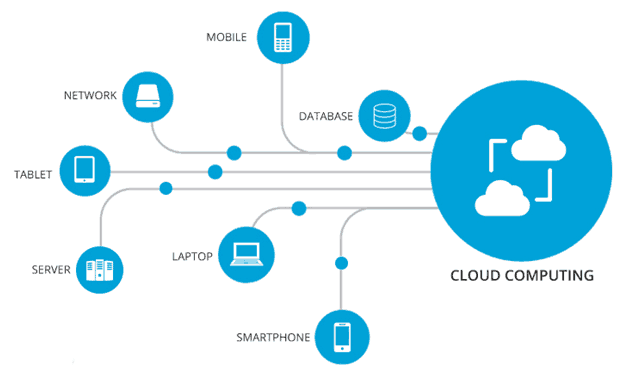
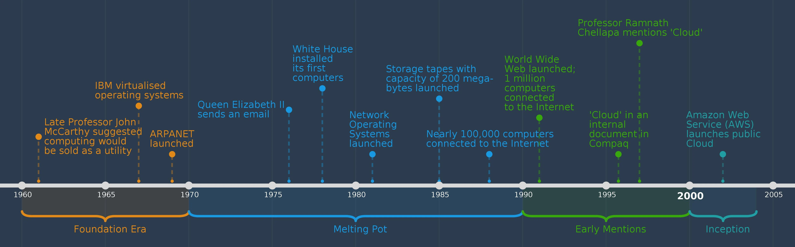

### Cloud Computing

#### What is Cloud Computing? 

Cloud computing is the delivery of computing resources - such as servers, storage, databases, networking, software, and analytics over the internet (”the cloud”). 

These resources are hosted and managed by cloud service providers (third party) in large data centres. Rather than users keeping files on a hard drive or local storage drive, cloud- based storage enables and makes it possible to save them to remote database. As long as you are connected to the internet,  you are able to access your data from anywhere.

**Key points:** 

- Cloud computing is the delivery of different services through the internet, this includes data storage, servers, databases, networking and software.
- Cloud-based storage makes it possible to save files to remote databased and retrieve, modify, access them on demand as long as you are connected to the internet.
- User is not required to be in a specific place to gain access the files in the cloud, allowing the user to work remotely. (one drive, SharePoint etc)
- It eliminates the need for individuals and businesses to self-manage physical resources themselves, and only pay for what they use.
 

#### History of Cloud Computing 

1) **1960s**: The idea of "utility computing" was first proposed by computer scientist John McCarthy, he suggested that computing one day will be sold as utility such as electricity and water. 

<lb>

2) **1970s - 1980s:** Some telecom companies began offering Virtual Private Network (VPN) services, which enabled companies to securely connect their organisation owned network over the internet.

<lb>

3) **1999**: Salesforce was one of the first companies to deliver software over the internet. This highlighted the introduction of Software as a Service (SaaS) model for delivering software applications.

<lb>

4) **2001 - 2004**: Amazon launched **Amazon Web Services** (AWS) in 2002 in order to provide computing storage to developers.

<lb>

5) **2005- 2011**: Amazon introduced **Elastic Compute Cloud** (EC2) in 2006, which allowed users to rent virtual computers which could be run on their own computers. Database services started becoming available on the cloud and the popular Dropbox concept facilitated cloud storage as a service. Cloud providers offered data centres in a few locations, but after 2008, multiple regions were available. Cloud computing became very popular, with companies like IBM, Oracle, and Google expanding their cloud services. 

<lb>

9) **2014**: Microsoft rebranded its cloud service from Windows Azure to Microsoft Azure and expanded its services.

<lb>

10) **2015**: Amazon introduced AWS Lambda, a serverless computing service, allowing developers to run code in response to specific events without having to manage servers.

<lb>

#### Uses of Cloud Computing 
Cloud computing offers a wide range of services that can be used for various purposes. Below are some key things you can do with cloud computing: 

- **Hosting Websites and Web Applications:**
Cloud platforms provide the infrastructure to host websites and web applications, ensuring they are accessible to users worldwide.

<lb> 

- **Storing and Managing Data:** Cloud storage services allow you to store and manage large volumes of data securely. This can be used for backups, archives, and file sharing.

<lb> 

- **Virtual Machines:** Computers within a computer. Cloud platforms offer virtualization and containerization services that allow you to run applications in isolated environments, providing flexibility and resource efficiency.

<lb> 

 - **Developing and Testing Applications:** Cloud environments provide tools and resources for software developers to build, test, and deploy applications. It offers scalability and cost-effective development resources.

<lb> 

- **Collaboration and Communication:** Cloud-based collaboration tools and communication platforms enable teams to work together, share documents, and communicate from anywhere in the world.

<lb> 

- **DevOps and Continuous Integration/Continuous Deployment (CI/CD):** Cloud platforms provide tools and services to automate the development, testing, and deployment of software, enhancing the efficiency of the development process.

#### Types of Cloud 

#### Private 
**Private cloud** means using a cloud infrastructure only by one customer/ organisation, and it is not shared with others. For example, Dell is one of the companies that offers private cloud services.
It is **single tenancy** meaning only data of a single organisation is stored in the cloud. The organisation will have their own administrator in order to manage their private cloud services. The organisation offers hardware, they buy all physical servers on which the cloud is build, which makes it more expensive. 

#### Public 
The cloud computing infrastructure is located on the premises of the company that offers the services.It is multi-tenancy which means multiple users or organisation are sharing the infrastructure and resources provided by the cloud service provider. Their data centre is on the internet where the cloud service providers are available, and they manage the services whereas the organisation uses them. 
This also means that unlike private cloud, the cloud service provider provides all the hardware for public cloud and ensures its working properly. This makes it cheaper in terms of accessing public cloud. 

  

<lb>

_Diagram showing an overview of Private and Public Cloud_ 
