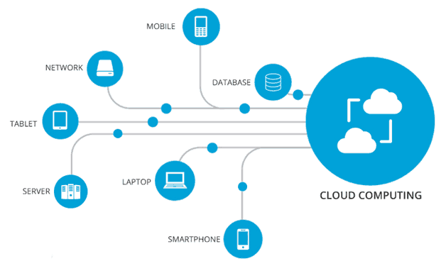
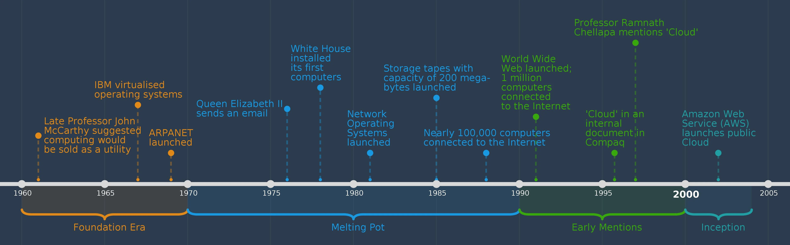

### Cloud Computing

#### What is Cloud Computing? 

Cloud computing is the delivery of computing resources - such as servers, storage, databases, networking, software, and analytics over the internet (”the cloud”). 

These resources are hosted and managed by cloud service providers (third party) in large data centres. Rather than users keeping files on a hard drive or local storage drive, cloud- based storage enables and makes it possible to save them to remote database. As long as you are connected to the internet,  you are able to access your data from anywhere.

**Key points:** 

- Cloud computing is the delivery of different services through the internet, this includes data storage, servers, databases, networking and software.
- Cloud-based storage makes it possible to save files to remote databased and retrieve, modify, access them on demand as long as you are connected to the internet.
- User is not required to be in a specific place to gain access the files in the cloud, allowing the user to work remotely. (one drive, SharePoint etc)
- It eliminates the need for individuals and businesses to self-manage physical resources themselves, and only pay for what they use.
 

#### History of Cloud Computing 

1) **1960s - 1970s**: The idea of "utility computing" was first suggested by computer scientist John McCarthy. He suggested that computing resources could be sold like electricity or water.

<lb>

2) **1980s - 1990s:** Telecom companies began offering Virtual Private Network (VPN) services, which enabled companies to securely connect their organisation owned network over the internet. This was an early introduction to cloud networking.

<lb>

3) **1999**: Salesforce, founded by Marc Benioff, was one of the first companies to deliver software over the internet. This highlighted the introduction of Software as a Service (SaaS) model for delivering software applications.

<lb>

4) **2002**: Amazon launched Amazon Web Services (AWS) in order to provide computing storage to developers.

<lb>

5) **2006**: Amazon introduced Elastic Compute Cloud (EC2), which allowed users to rent virtual computers which could be run on their own computers. 

<lb>

6) **2008**: Google introduced Google App Engine, a platform for developing and hosting web applications in Google-managed data centers.

<lb>

7) **2009:** Microsoft launched Windows Azure,a cloud computing platform, which included storage and other services.

<lb>

8) **2010s:** Cloud computing became very popular, with companies like IBM, Oracle, and Google expanding their cloud services. 

<lb>

9) **2014**: Microsoft rebranded its cloud service from Windows Azure to Microsoft Azure and expanded its services.

<lb>

10) 2015: Amazon introduced AWS Lambda, a serverless computing service, allowing developers to run code in response to specific events without having to manage servers.

<lb>

#### Uses of Cloud Computing 
Cloud computing offers a wide range of services that can be used for various purposes. Below are some key things you can do with cloud computing: 

- **Hosting Websites and Web Applications:**
Cloud platforms provide the infrastructure to host websites and web applications, ensuring they are accessible to users worldwide.

<lb> 

- **Storing and Managing Data:** Cloud storage services allow you to store and manage large volumes of data securely. This can be used for backups, archives, and file sharing.

<lb> 

- **Virtual Machines:** Cloud platforms offer virtualization and containerization services that allow you to run applications in isolated environments, providing flexibility and resource efficiency