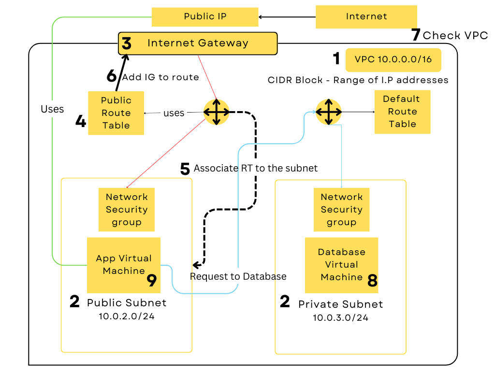

### Virtual Private Cloud (VPC)

**VPC** is a **virtual network** and your AWS account includes a default VPC in each AWS Region. Your default VPCs are configured such that you can immediately start launching and connecting to EC2 instances.
However creating a custom **VPC** means you have greater control over security such as IP address range, subnets, route tables etc. 

**Subnets** - A subnet is a range of IP adddresses in your VPC. Subnet must reside in a single Availability zone. 

**IP Addressing** - You can assign IP addresses, IPv4 to your VPCs and subnets. 

**Routing**- You use route tables to determine where network traffic from your subnet or gateway is directed. 

**Internet Gateway** - A gateway connects your VPC to another network. For example, use an internet gateway to connect your VPC to the internet.

**Public Subnet** - In a public subnet, resources can have public IP addresses, allowing them to communicate directly with the internet.
The public subnet has a route table that directs traffic to the internet through an Internet Gateway (IGW). This enables resources in the public subnet to access the internet.

**Private Subnet** - In a private subnet, resources do not have direct internet access. They can't access the internet without going through a specific route.

