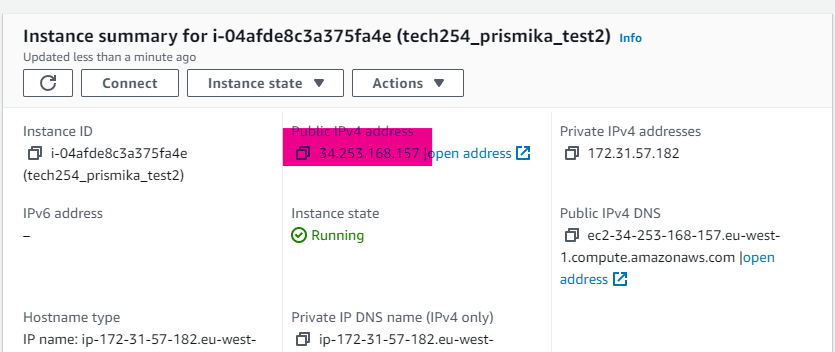
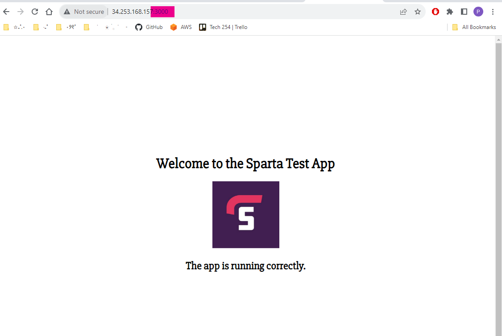

### How to get an app code into an EC2 instance and deploy it. 

#### Get an app code into an EC2 Instance. 

1) Open git bash terminal on your local machine. 

2) First, we need to run the `scp` command with our private key to secure copy to your EC2 instance. 

Example: 
```
Prismika@Pris MINGW64 ~/.ssh
scp -i "~/.ssh/tech254.pem"
usage: scp [-346ABCOpqRrsTv] [-c cipher] [-D sftp_server_path] [-F ssh_config]
           [-i identity_file] [-J destination] [-l limit] [-o ssh_option]
           [-P port] [-S program] [-X sftp_option] source ... target
```

3) Then we need to initalise using the `scp` command to copy our local file to an EC2 instance. In this case, I am copying `C:\Users\Prismika\PycharmProjects\AWS_and_Cloud_Computing\app` to my `ec2-34-253-51-15.eu-west-1.compute.amazonaws.com` instance.

Example:

```
$ scp -i "C:\Users\Prismika\.ssh\tech254.pem" -r "C:\Users\Prismika\PycharmProjects\AWS_and_Cloud_Computing\app" ubuntu@ec2-34-253-51-15.eu-west-1.compute.amazonaws.com:~
```
Breakdown of the command: 
- **`scp`**: Secure copy, used for securely copying files.
- **`i "C:\Users\Prismika\.ssh\tech254.pem"`**: private key file path to use for authentication.
- **`r`**: Indicates that you're copying a file recursively.
- **`"C:\Users\Prismika\PycharmProjects\AWS_and_Cloud_Computing\app"`**: This is the path to the directory you want to copy from your local machine.
- **`ubuntu@ec2-34-253-51-15.eu-west-1.compute.amazonaws.com`**: This is the username and public DNS name of your EC2 instance.
- **`:~`**: This is the destination path on the remote instance. The tilde (**`~`**) represents the home directory of ubuntu remote server.

##### Start EC2 instance

4) Run `ssh -i "tech254.pem" ubuntu@ec2-34-253-51-15.eu-west-1.compute.amazonaws.com` to start EC2 instance.

5) Run `ls` to check if our file has been copied over to our EC2 instance. In this case, my file 'app' has been successfully copied over to my EC2 instance. 

Example:
```
ubuntu@ip-172-31-60-44:~$ ls
app  cat.txt  provision.sh

```


#### Deploying app to EC2 instance 

1) Start our EC2 instance on our terminal by running `ssh -i "tech254.pem" ubuntu@ec2-34-253-51-15.eu-west-1.compute.amazonaws.com` 

2) Execute our script for EC2 instance by running `./provision.sh ` (need to make sure the nano script is made before executing it!)

if you have not created a script to execute, you can run the following command one by one: 

```
sudo apt upgrade -y

sudo apt install nginx -y

sudo systemctl start nginx

```
3) You can also check the status by running` sudo systemctl status nginx` command to check if your nginx web server is running or not. 

4) Then we need to run the command `ls` in our server home directory as this is where our code was saved. 
Example: 

```
ubuntu@ip-172-31-60-44:~$ ls
app  cat.txt  provision.sh
```

5) Now we want to go into our 'app'- we do this by running `cd app`and we want to check the files in this app by running `ls` again. 

Example: 
```
ubuntu@ip-172-31-60-44:~/app$ ls
app

```
6) Since, I want to access the 'app' folder within my 'app folder' I have run the `cd app` command again to access the folder, followed by `ls` after.

Example: 

```
ubuntu@ip-172-31-60-44:~/app$ cd app
ubuntu@ip-172-31-60-44:~/app/app$ ls
README.md  models        package-lock.json  provsion.sh  seeds  views
app.js     node_modules  package.json       public       test

```

7) Now that I am finally inside the app folder, since I want to run the 'app.json' file, I will need to install nodejs package so it can run this file. This command is used to add the Node.js 12.x repoistory to my system. 

```
curl -sL https://deb.nodesource.com/setup_12.x | sudo -E bash -
```

8) After it has been added to the system, I have then installed the node js package by running the following command. I can verify the installation by running `node -v`to check the version. 

```
sudo apt install nodejs -y

```
9) `sudo npm install pm2 -g` by running this command, it installs PM2 globally, allowing you to use it to manage Node.js applications from the command line.
- `npm`: stands for node packet manager and is used for installing and managing Node.js packages.
- `pm2` - PM2 is a process manager for Node.js applications.
- `g` - this flag stands for "global". It means that PM2 will be installed globally on your system, making it available as a command-line tool.

10) We need to make sure we are still in the right directory by running `ls`. Then we can run the command `npm install` which looks for a package.json file in the current directory.

Example: 
```
ubuntu@ip-172-31-60-44:~/app/app$ npm install

> solution-code@1.0.0 postinstall /home/ubuntu/app/app
> node seeds/seed.js

npm WARN solution-code@1.0.0 No repository field.
npm WARN The package jenkins-mocha is included as both a dev and production dependency.

audited 198 packages in 3.18s

9 packages are looking for funding
  run `npm fund` for details

found 43 vulnerabilities (1 low, 19 moderate, 12 high, 11 critical)
  run `npm audit fix` to fix them, or `npm audit` for details

┌──────────────────────────────────────────────────────────┐
│                 npm update check failed                  │
│           Try running with sudo or get access            │
│           to the local update config store via           │
│ sudo chown -R $USER:$(id -gn $USER) /home/ubuntu/.config │
└──────────────────────────────────────────────────────────┘

```

11) Finally, we can run the command `node app.js ` which is used to run the javascript file and execute it. 

Example:

```
ubuntu@ip-172-31-60-44:~/app/app$ node app.js
Your app is ready and listening on port 3000
```

12) You can now go onto your EC2 instance summary in AWS and copy your public IP address on your URL followed by `:3000` after.

Example: 


