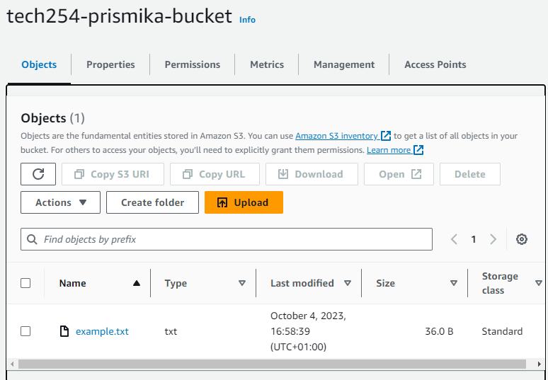

# Python scripts using boto3

Python scripts created to do CRUD on s3 using boto3. 

#### Creating a bucket

1) First we need to set up boto3 on a our EC2 instance by running the following command: 

`pip install boto3`

2) Create a blank text file `filename.py` and in this python file we are creating a script to create a new bucket on s3.

```notion
ubuntu@ip-172-31-49-105:~$ sudo nano create-bucket.py
```

3) Below is the script that I have written into the python text file.

```bash
import boto3

# Create an S3 client
s3 = boto3.client('s3')

# Create the bucket with the specified location constraint
s3.create_bucket(Bucket='tech254-prismika-bucket', CreateBucketConfiguration={'LocationConstraint': 'eu-west-1'})

#printing back an output message to show it was successful.
print("Creation of bucket was successful!")

```

4) In order to run and execute this file, we need change permission so we do this by running the command sudo `chmod +x create-bucket.py`

5) Then we can run the file `python create-bucket.py`

A print message should be printed out if bucket creation was successful.

```
ubuntu@ip-172-31-49-105:~$ python create-bucket.py
/home/ubuntu/.local/lib/python2.7/site-packages/boto3/compat.py:86: PythonDeprecationWarning: Boto3 will no longer support Python 2.7 starting July 15, 2021. To continue receiving service updates, bug fixes, and security updates please upgrade to Python 3.6 or later. More information can be found here: https://aws.amazon.com/blogs/developer/announcing-end-of-support-for-python-2-7-in-aws-sdk-for-python-and-aws-cli-v1/
warnings.warn(warning, PythonDeprecationWarning)
Creation of bucket was successful!


```

#### Uploading a file into the bucket

1) Run sudo nano `upload-file.py` 

2) Entered the following script in the blank py file:

```
import boto3

s3 = boto3.client('s3')

bucket_name = 'tech254-prismika-bucket'
filename = 'example.txt'
s3_file_name = 'example.txt'

s3.upload_file(filename, bucket_name, s3_file_name)

print("file has been successfully uploaded!")

```

3) Changed the permission execution of the file by running `sudo chmod +x upload-file.py`

4) Executed the file by running `python upload-file.py` and successfully uploaded a file into my s3 bucket. 



#### Downloading a file from bucket

1) `sudo nano download-file.py`

2) Script written to download file from bucket:

```
import boto3

s3 = boto3.client('s3')

bucket_name = 'tech254-prismika-bucket'
s3_file_name = 'example.txt'
download_name = 'download_file_example.txt'

s3.download_file(bucket_name, s3_file_name, download_name)

print("file has been successfully downloaded!")

```

3) `ls` to see the downloaded file. 

```
file has been successfully downloaded!
ubuntu@ip-172-31-49-105:~$ ls
create-bucket.py  delete-bucket.py  download-file.py  download_file_example.txt  example.txt  s3_downloads  upload-file.py

```


#### Deleting a bucket 

1) Run command `ubuntu@ip-172-31-49-105:~$ sudo nano delete-bucket.py` to open and create a new text file.

2) Deletion script written in the python text file:

```
import boto3

s3 = boto3.client('s3')

bucket_name = 'tech254-prismika-bucket'

s3.delete_bucket(Bucket='tech254-prismika-bucket')

print("Bucket has been successfully deleted!")
```


3) `sudo chmod +x delete-bucket.py` to change execution permission.

4) Execute file by running `python delete-bucket.py`

```
ubuntu@ip-172-31-49-105:~$ python delete-bucket.py
/home/ubuntu/.local/lib/python2.7/site-packages/boto3/compat.py:86: PythonDeprecationWarning: Boto3 will no longer support Python 2.7 starting July 15, 2021. To continue receiving service updates, bug fixes, and security updates please upgrade to Python 3.6 or later. More information can be found here: https://aws.amazon.com/blogs/developer/announcing-end-of-support-for-python-2-7-in-aws-sdk-for-python-and-aws-cli-v1/
  warnings.warn(warning, PythonDeprecationWarning)
Bucket has been successfully deleted!


```